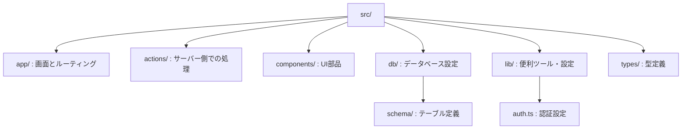
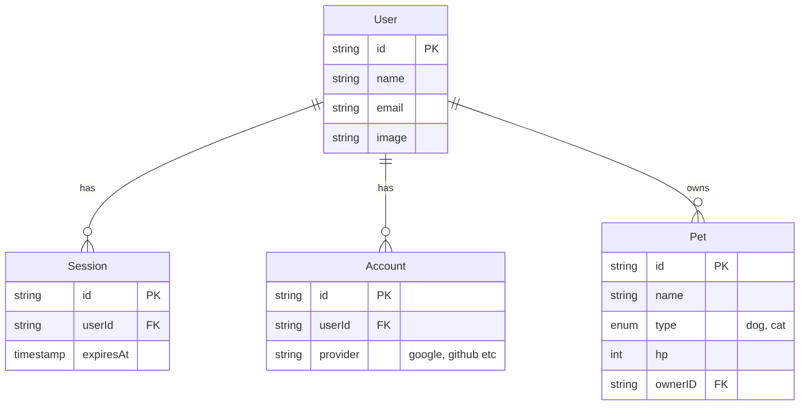
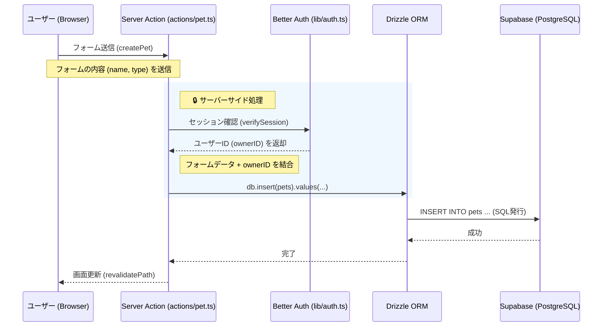

# アプリケーションアーキテクチャとデータフローの完全解説

**学習日**: 2025-11-24
**参照ドキュメント**:
- [Next.js App Router](https://nextjs.org/docs)
- [Drizzle ORM](https://orm.drizzle.team/)
- [Better Auth](https://better-auth.com/)
- [Supabase](https://supabase.com/docs)

---

## 1. 🧠 概念と前提知識（The Big Picture）

このアプリケーションは、**「フルスタック・サーバーレス・アーキテクチャ」**を採用しています。
従来のWeb開発では、フロントエンド（画面）とバックエンド（APIサーバー）を別々に作ることが多かったですが、Next.js (App Router) を使うことで、これらを一つのプロジェクト内でシームレスに統合しています。

### 主な登場人物（技術スタック）

| 役割 | 技術 | 説明 |
| :--- | :--- | :--- |
| **フレームワーク** | **Next.js (App Router)** | アプリ全体の骨組み。画面表示（React）とサーバー処理（API/Server Actions）の両方を担当。 |
| **データベース** | **PostgreSQL (Supabase)** | データの保管場所。Excelのシートのようなテーブル形式でデータを管理。 |
| **ORM** | **Drizzle ORM** | アプリ(TypeScript)とデータベース(SQL)の翻訳機。SQLを書かずにTSでDB操作が可能。 |
| **認証** | **Better Auth** | ログイン機能の専門家。セッション管理やOAuth（Googleログイン等）を裏側で処理。 |

---

## 2. 🏗 アプリ全体の構造（ディレクトリマップ）

`src` フォルダの中身が、このアプリの心臓部です。各フォルダの役割を整理しましょう。



### 各フォルダの役割詳細

1.  **`app/` (Router & View)**
    - **役割**: ページ（URL）の構造を定義し、画面を表示します。
    - **特徴**: ファイルシステムベースのルーティング（フォルダ名がそのままURLになる）。
    - **例**: `app/pets/[id]/page.tsx` は `/pets/123` というURLに対応。

2.  **`actions/` (Controller / Mutation)**
    - **役割**: データの作成・更新・削除など、**「サーバー側で実行したい処理」**を関数として定義。
    - **特徴**: `use server` ディレクティブにより、クライアント（ブラウザ）から直接呼び出せるが、実行はサーバーで行われる（Server Actions）。
    - **例**: `createPet`（ペット登録）, `updatePet`（更新）。

3.  **`db/` (Model / Database)**
    - **役割**: データベースとの接続設定と、データの形（スキーマ）の定義。
    - **重要ファイル**:
        - `index.ts`: DBへの接続を確立する場所。
        - `schema/*.ts`: テーブルの設計図。

4.  **`lib/` (Configuration / Utils)**
    - **役割**: アプリ全体で使う設定や便利関数。
    - **重要ファイル**:
        - `auth.ts`: Better Authの設定（認証のルール）。
        - `session.ts`: 現在ログインしているユーザー情報を取得する関数。

---

## 3. 🛠 バックエンドの仕組みとデータフロー

ここが今回一番気になっている「裏側」の部分です。
**「データベース」「ORM」「認証」**がどう連携しているのか、図解します。

### 3.1 データベース設計（ER図）

Drizzleのスキーマ（`src/db/schema/`）で定義されたデータ構造です。



- **User**: ユーザー本体。
- **Session**: ログイン状態を管理。Better Authが自動的に作成・削除します。
- **Account**: Googleログインなどの連携情報。
- **Pet**: アプリ固有のデータ。`ownerID` で `User` と紐付いています（誰のペットか）。

### 3.2 データの流れ（Data Flow）

ユーザーが「ペットを登録する」時のデータの流れを見てみましょう。



#### 解説: プロップスとデータの受け渡し

1.  **入力 (Client)**:
    - ユーザーがフォームに入力した `name`, `type` は、`FormData` として Server Action に渡されます。
2.  **検証と認証 (Server)**:
    - `actions/pet.ts` 内で `verifySession()` を呼び出し、**「今リクエストしてきたのは誰か？」**（`ownerID`）を特定します。これはセキュリティ上非常に重要です（なりすまし防止）。
3.  **保存 (Database)**:
    - `db.insert(pets)` を使って、フォームのデータと特定した `ownerID` をセットにしてDBに保存します。

---

## 4. 📝 実際のコードと文脈（Code Context）

### 4.1 スキーマ定義 (`src/db/schema/pet.ts`)

これが「データの設計図」です。

```typescript
// Drizzleのツールをインポート
import { pgTable, text, integer, pgEnum } from "drizzle-orm/pg-core";
import { user } from "./auth"; // Userテーブルとの紐付け用

// ペットの種類を定義（Enum）
export const petType = ["dog", "cat"] as const;
export const petTypeEnum = pgEnum("pet_type", petType);

// テーブル定義
export const pets = pgTable("pets", {
  id: text("id").primaryKey(), // ID（主キー）
  name: text("name").notNull(), // 名前（必須）
  type: petTypeEnum("type").notNull(), // 種類（dog/cat）
  hp: integer("hp").notNull().default(50), // HP（デフォルト50）
  
  // 外部キー制約: UserテーブルのIDと紐付く
  ownerID: text("owner_id")
    .notNull()
    .references(() => user.id, { onDelete: "cascade" }) 
    // cascade: ユーザーが消えたらペットも消える
});
```

### 4.2 サーバーアクション (`src/actions/pet.ts`)

これが「データの処理係」です。

```typescript
'use server'; // これにより、この関数はサーバーでのみ実行される

import { db } from '@/db';
import { pets } from '@/db/schema/pet';
import { verifySession } from '@/lib/session';

export async function createPet(formData: any) {
    // 1. ログイン中のユーザーを確認
    const session = await verifySession();
    const ownerID = session.user.id;

    // 2. データベースに保存
    await db.insert(pets).values({
        name: formData.name,
        type: formData.type,
        ownerID: ownerID, // ここでユーザーIDを自動付与
    });
}
```

---

## 5. ⚖️ 技術選定とプロ視点の分析

### なぜこの構成なのか？

1.  **型安全性 (Type Safety)**:
    - Drizzle ORM と TypeScript を組み合わせることで、**「DBのカラム名ミス」や「型不一致」をコードを書いている時点で検知**できます。
    - `schema.ts` を変更すると、それを使っている全てのコードで型チェックが走ります。

2.  **開発効率**:
    - Server Actions により、APIエンドポイント（`/api/create-pet` など）をわざわざ作る必要がありません。関数を呼ぶ感覚でバックエンド処理が書けます。

3.  **セキュリティ**:
    - Better Auth がセッション管理を、Drizzle がSQLインジェクション対策を、Server Actions がサーバーサイド実行を保証することで、堅牢なセキュリティを低コストで実現しています。

### 初学者がハマりやすいポイント

- **「どこで実行されているか？」**: `console.log` を書いたとき、ブラウザのコンソールに出るのか、ターミナル（サーバー）に出るのかを意識しましょう。
    - `use client` のファイル → ブラウザ
    - `use server` のファイル / Server Component → ターミナル
- **非同期処理 (`await`)**: DB操作や認証確認はすべて時間がかかる処理（非同期）なので、必ず `await` が必要です。

---

## 6. 📖 さらなる理解のための推奨リソース

1.  **Drizzle ORM**: [Schema Definition](https://orm.drizzle.team/docs/sql-schema-declaration) - スキーマの書き方をもっと詳しく。
2.  **Next.js**: [Server Actions and Mutations](https://nextjs.org/docs/app/building-your-application/data-fetching/server-actions-and-mutations) - サーバーアクションの公式解説。
